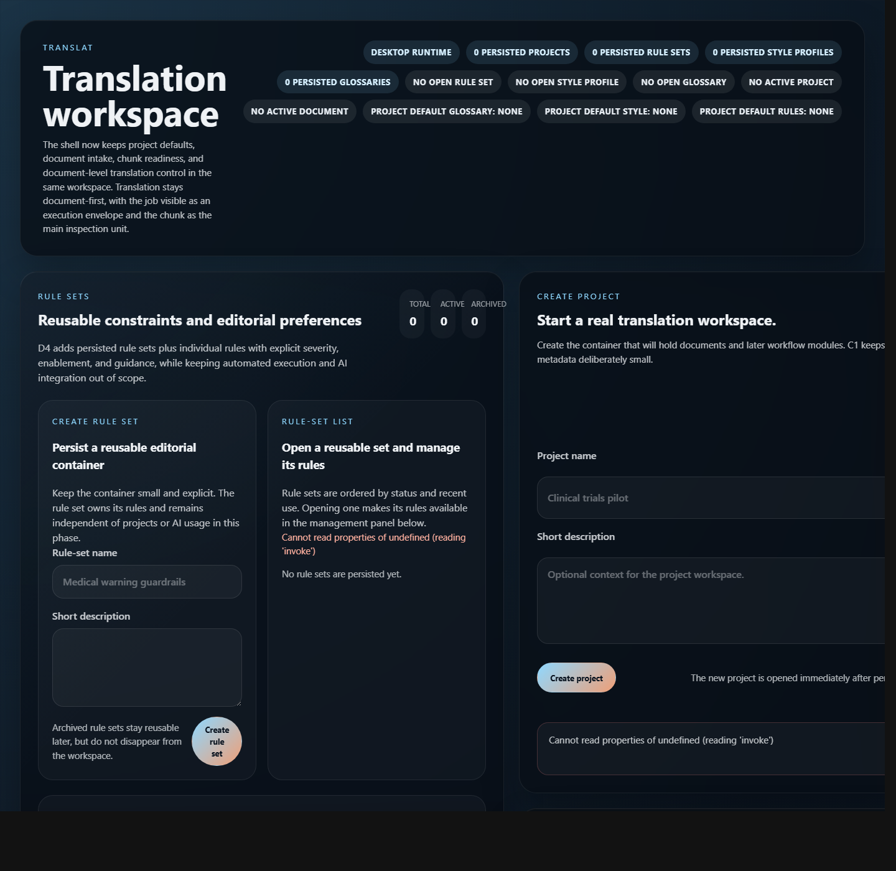
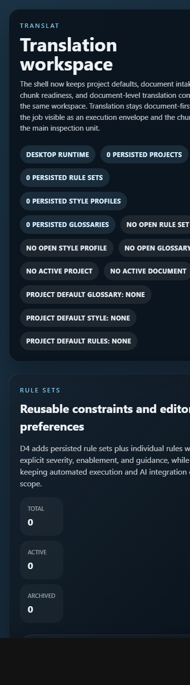

# TR-29 UI/UX audit

## Scope
Figma required.

TR-29 audits the current browser-rendered UI at `http://127.0.0.1:1420/` so TR-30 and TR-31 can redesign Translat from evidence rather than taste. This audit is based on the in-app/browser-local state available during Release 08 planning and the frontend workflow constraints from TR-16, TR-24, and TR-28.

This is an audit task, not an implementation task. No runtime behavior is changed here.

## Evidence
- Desktop first viewport: `docs/product/assets/TR-29/desktop-top.png`
- Desktop full page: `docs/product/assets/TR-29/desktop-full-page.png`
- Mobile first viewport: `docs/product/assets/TR-29/mobile-top.png`
- Runtime inspected: `dev:web` via Vite, browser URL `http://127.0.0.1:1420/`

## Runtime caveat
The browser-only runtime does not provide the Tauri command bridge. Errors such as `Cannot read properties of undefined (reading 'invoke')` are expected in `dev:web` when components call desktop commands directly.

These errors are still useful as UX evidence because the current UI exposes raw technical failures in primary panels, but they should not be interpreted as proof that the same command fails inside a healthy Tauri window.

## Executive diagnosis
The current UI is functionally broad but visually and operationally flat. It exposes many product modules at once, uses near-identical cards for unrelated levels of work, and starts with technical state rather than the user's next translation action.

The most important issue is not the dark palette alone. The core problem is information architecture: project creation, rule sets, style profiles, glossaries, document intake, chunk inspection, job progress, QA, debug trace, and healthcheck all compete as equal surfaces.

## Prioritized findings

### P0
1. The first screen lacks a primary operating object.
   - Current state: the hero says "Translation workspace", but the first actual work surface is rule-set management, while project creation is secondary and document work is below the fold.
   - Impact: the user cannot tell whether the app is asking them to create a project, configure editorial artifacts, import a document, or inspect jobs.
   - Target: TR-30 must define one shell route where the active object is always project, document, chunk, job, or finding.

2. The navigation model is a long page of equal panels, not a workstation.
   - Current state: rule sets, project composer, style profiles, glossaries, workspace, debug trace, segment browser, and healthcheck stack vertically.
   - Impact: users must scroll to discover core translation work, and module order communicates implementation history rather than workflow priority.
   - Target: TR-30 must introduce persistent navigation and a focused workspace area. Editorial libraries should be navigable support areas, not always-open primary panels.

3. The Translation Workspace is not visually dominant enough.
   - Current state: document, chunk, job, QA, export, and operational trace exist in code, but the page starts with rule/style/glossary surfaces.
   - Impact: this contradicts the product model that document is the primary operating object and chunk/job are the operational translation surfaces.
   - Target: TR-30/TR-31 should make the document workspace the central screen after project selection.

4. Debug and implementation details are promoted to primary UX.
   - Current state: command wrapper, healthcheck, raw ids, operational trace, and Tauri command errors appear alongside product work.
   - Impact: technical observability overwhelms translator/reviewer decision-making.
   - Target: technical diagnostics should move behind a developer/diagnostics mode or collapsible secondary rail.

5. Browser-only command failures are shown as raw product errors.
   - Current state: `Cannot read properties of undefined (reading 'invoke')` appears in user-facing panels.
   - Impact: in `dev:web`, the app looks broken before the user can evaluate the UI.
   - Target: TR-32 should provide a graceful browser runtime state: "Desktop commands unavailable in web preview" with degraded mock-safe behavior or disabled actions.

### P1
6. Header metadata is excessive and hard to scan.
   - Current state: the first viewport includes many equal badges for persisted projects, rule sets, style profiles, glossaries, open artifacts, active document, and project defaults.
   - Impact: status density hides the few statuses that matter for the current workflow.
   - Target: TR-31 should define a status hierarchy: global runtime, active project/document, current job, then secondary library counts.

7. Copy is explanatory instead of operational.
   - Current state: many panels explain release history or implementation boundaries, such as "D4 adds persisted rule sets..." and "C1 keeps the metadata deliberately small."
   - Impact: the UI reads like internal documentation.
   - Target: TR-31 should replace implementation-stage copy with short object/state/action labels.

8. Cards are nested and visually repetitive.
   - Current state: page sections are cards, and repeated inner panels are also cards.
   - Impact: hierarchy is blurred because every surface has similar border, radius, shadow, and density.
   - Target: TR-31 must define fewer surface levels and reserve cards for repeated items, modals, or framed tools.

9. Visual rhythm is too heavy for professional desktop work.
   - Current state: large radii, blurred surfaces, large padded panels, uppercase labels, and many pill badges dominate the view.
   - Impact: less content fits, and the interface reads as decorative rather than precise.
   - Target: TR-31 should reduce radii, rely on clearer typographic hierarchy, and use denser table/list patterns for operational data.

10. No clear separation between setup libraries and active translation execution.
    - Current state: rule sets, style profiles, and glossaries are open by default before any project/document is active.
    - Impact: editorial artifacts feel like mandatory setup rather than reusable context layers.
    - Target: TR-30 should define libraries as side navigation areas or contextual drawers, while preserving separate concepts for glossary, style, and action-scoped rules.

11. Empty states are verbose and not action-led.
    - Current state: empty states explain persistence and future module intent.
    - Impact: the next action is less prominent than product explanation.
    - Target: every empty state should answer: what is missing, why it matters, and the one action to continue.

12. Mobile layout is technically responsive but unusable as a product workflow.
    - Current state: the mobile capture keeps the same long stack and horizontal overflow is visible around badges/text.
    - Impact: small viewports do not preserve the workflow; they only serialize the desktop problem.
    - Target: TR-30/TR-31 should define which panels collapse, which move into tabs, and which are hidden behind secondary navigation.

### P2
13. Button styles overuse pill shapes and gradient emphasis.
    - Current state: most commands use rounded pill buttons, including technical actions and primary actions.
    - Impact: primary vs secondary vs diagnostic commands are not distinct enough.
    - Target: TR-31 should define command hierarchy with restrained primary buttons and familiar icon affordances where appropriate.

14. Status tone language is useful but visually over-applied.
    - Current state: badges communicate many states but have similar size and weight.
    - Impact: warning/error/success signals compete with neutral metadata.
    - Target: keep semantic tones, but assign size/placement rules by severity and workflow relevance.

15. Raw identifiers occupy scarce space.
    - Current state: project id, document id, tracked job id, selected job id, and command names can become prominent.
    - Impact: auditability is present, but review ergonomics suffer.
    - Target: show ids on demand, copyable from detail/trace drawers, not in primary reading flow.

16. Segment Browser is below Translation Workspace even though segment is the atomic review unit.
    - Current state: segment inspection appears after debug trace and workspace explanation.
    - Impact: segment traceability is preserved technically but not placed where reviewers expect it.
    - Target: TR-30 should decide whether segment detail is a tab inside chunk detail, a right-side trace drawer, or a review mode.

17. Healthcheck is visually equivalent to product surfaces.
    - Current state: Healthcheck sits in the sidebar as another card.
    - Impact: runtime diagnostics compete with active work.
    - Target: move healthcheck to a compact global indicator plus diagnostics detail.

18. Long labels risk overflow or poor scan on narrow viewports.
    - Current state: badges and headings such as "Project default glossary: none" consume full rows on mobile.
    - Impact: mobile and narrow desktop layouts feel broken even when content does not technically overlap.
    - Target: TR-31 should define short labels, truncation, and tooltip/detail rules.

## Required screen grouping for TR-30
TR-30 should not start from the current vertical order. It should define an information architecture with these groups:

1. Projects
   - create/open project
   - recent projects
   - active project summary

2. Document Workspace
   - import document
   - segment/process document
   - build chunks
   - active document readiness

3. Translation Workspace
   - chunk list/timeline
   - selected chunk source/context/result/incident
   - persistent job monitor
   - QA findings and correction path
   - export readiness

4. Editorial Libraries
   - glossaries
   - style profiles
   - rule sets and action-scoped rules
   - project defaults linking these artifacts

5. Diagnostics
   - runtime health
   - command bridge status
   - operational trace
   - raw ids and task-run internals

## Panels to remove, group, or demote
- Remove from primary first screen: standalone healthcheck card, command-pattern card, implementation-stage explanatory blocks.
- Group into Editorial Libraries: rule-set management, style profile management, glossary management.
- Demote to Diagnostics: operational debug panel, raw command wrappers, raw ids, browser/Tauri bridge details.
- Keep central: Translation Workspace, active document readiness, chunk browser, job monitor, QA findings.
- Keep but reposition: Project composer/list as entry shell or left navigation, not a peer of every module.

## Figma targets for TR-30
TR-30 should produce information architecture/wireframes for:
- app shell with persistent navigation
- no-project state
- project open with no document
- document imported but not segmented
- document segmented but chunks missing
- chunk-ready document
- job running
- completed with incidents
- review-ready with QA findings
- diagnostics mode

TR-30 must explicitly decide:
- whether editorial libraries are separate routes, tabs, or drawers
- where project defaults are edited
- where segment trace appears relative to selected chunk
- where job monitor stays visible during chunk inspection
- how web-preview/Tauri-unavailable state is represented

## Figma targets for TR-31
TR-31 should define the applied visual system for:
- restrained desktop palette with fewer decorative gradients
- surface levels with card nesting rules
- type scale and density for professional translation work
- compact status badges and progress indicators
- primary/secondary/destructive/diagnostic command styling
- responsive behavior for narrow desktop and mobile
- empty/loading/error/disabled states

## Acceptance check against TR-29
- Prioritized P0/P1/P2 findings exist.
- Current visual evidence is saved under `docs/product/assets/TR-29/`.
- Product problems are separated from `dev:web` Tauri bridge limitations.
- Screens/panels to remove, group, or demote are identified.
- TR-30/TR-31 have clear design questions and target states.
