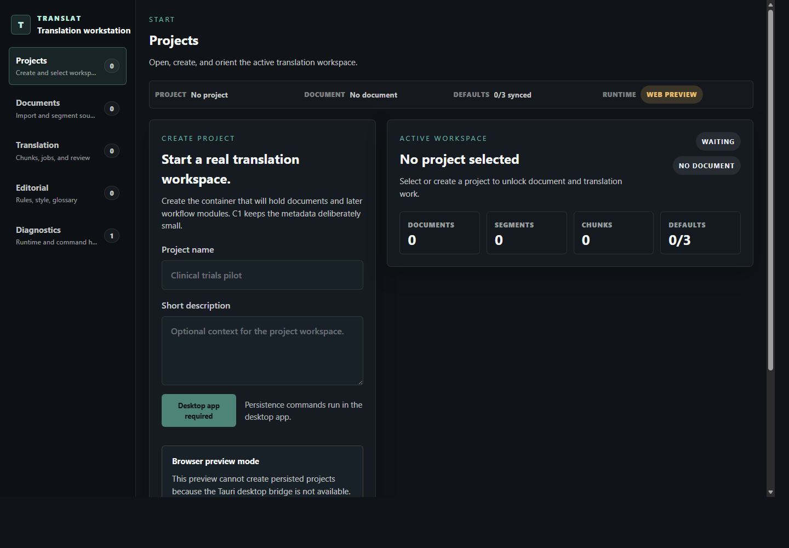
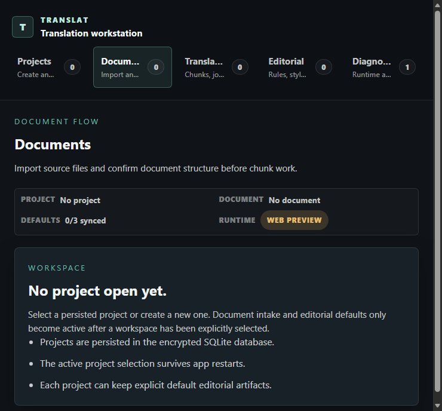
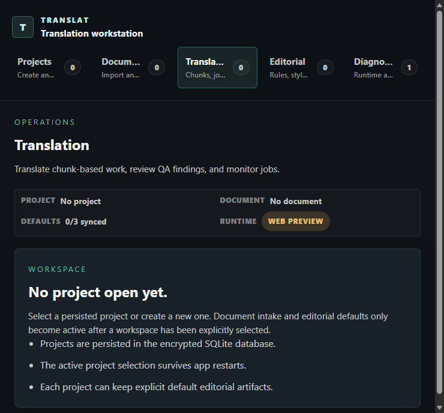
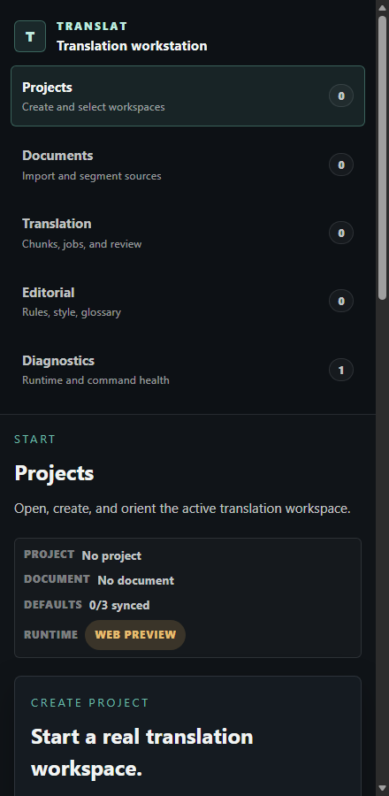
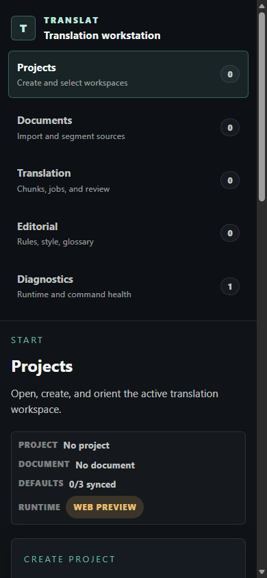

# TR-34 Visual Validation

## Scope
Figma not required.

TR-34 validates the Release 08 shell and Translation Workspace already designed in TR-30/TR-31 and implemented in TR-32/TR-33. This task records visual, responsive, operational-state, and technical validation evidence; it does not introduce a new structural design.

Validation date: 2026-04-21.

## Evidence
- Browser runtime: `http://127.0.0.1:1420/`
- Desktop capture: `docs/product/assets/TR-34/browser-desktop.png`
- Intermediate responsive Documents capture: `docs/product/assets/TR-34/browser-tablet.png`
- Intermediate responsive Translation capture: `docs/product/assets/TR-34/browser-tablet-translation.png`
- Wide phone capture: `docs/product/assets/TR-34/browser-phone-wide.png`
- Mobile capture: `docs/product/assets/TR-34/browser-mobile.png`
- Browser mode: Vite web preview, with Tauri command bridge unavailable.

## Technical Checks
| Check | Result | Notes |
|---|---:|---|
| `npm run lint` | Pass | Biome checked `src/frontend`. |
| `npm run typecheck` | Pass | `tsc --noEmit`. |
| `npm run build:web` | Pass | Vite production web build completed. |
| `npm run check:scaffold` | Pass | Required scaffold paths present. |
| `npm run check:desktop` | Blocked | Local Rust toolchain error: `rustc.exe` is not applicable to `stable-x86_64-pc-windows-msvc`. |
| `npm run build` | Blocked | `tauri build` panics in `tauri-cli` at `crates\tauri-cli\src\interface\rust.rs:1149:14` after the same toolchain issue. |

## Browser Runtime Findings
The browser preview renders the redesigned shell without a blank screen at desktop and mobile sizes. Because this is a web preview, desktop commands cannot run without the Tauri bridge; persistence actions are disabled and surfaced as explicit browser-preview runtime states rather than raw command failures.

Desktop viewport:
- Left navigation, compact operational context, project composer, and active workspace overview are visible in the first viewport.
- Primary hierarchy is readable: `Projects` route, project creation, active workspace summary.
- No obvious text overlap in the captured viewport.
- The page scrolls vertically; lower form error content is partly below the first viewport.

Mobile viewport:
- Navigation collapses into a vertical stacked layout.
- Brand, nav entries, view title, and project creation flow remain readable.
- No obvious horizontal clipping in the captured viewport.
- The content requires vertical scrolling, which is expected for the current shell structure.

Wide phone viewport:
- The shell content uses the full available 400-449px range instead of clamping to a narrow fixed column.
- Compact operational context keeps runtime availability visible in the primary shell.

Intermediate responsive viewport:
- Documents and Translation navigation use a compact horizontal row without an elastic empty area below the tabs.
- The view header starts immediately after the navigation boundary, preserving route orientation without duplicated chrome.

## Operational State Matrix
| State | Validation method | Result |
|---|---|---|
| Empty app / no project | Browser capture | Covered. Shell renders, no project context is clear. |
| Project open / no document | Static review of `ProjectWorkspace` render path | Covered in code. Project summary, editorial defaults, importer, document list, and segment trace are reachable under `document-workspace`. |
| Document imported but not segmented | Static review | Covered. Translation document rows disable non-segmented documents and direct users to segment first. |
| Document segmented, no chunks | Static review | Covered. Translation header shows blocked readiness and `Build chunks`; chunk rail shows next action. |
| Chunk-ready document | Static review | Covered. Translation header enables `Translate document` only after chunks exist and keeps `Rebuild chunks` available. |
| Selected chunk | Static review | Covered. Center panel shows source, context, result, incident, and segment trace sections. |
| Job without progress | Static review | Covered. Job monitor has tracked-job and no-task-run states. |
| Job running | Static review | Covered. Header progress, refresh action, job monitor counters, and running status badges stay visible. |
| Job completed | Static review | Covered. Job status tone and counters support completed state; export readiness depends on completed status or persisted target text. |
| Job incidents / failed chunks | Static review | Covered. Incident chunks are sorted first in the chunk rail and shown in job monitor affected chunks. |
| QA empty | Static review | Covered. Finding review shows a no-findings state. |
| QA findings | Static review | Covered. Finding list, selected finding detail, anchor status, related segments, and retranslation action are represented. |
| Export-ready state | Static review | Covered. Export action remains visible and becomes secondary when the document is export-ready. |
| Diagnostics | Static review | Covered. Operational debug view remains separate from the primary Translation route. |

## Accessibility And Layout Review
- The shell uses real buttons for navigation, project actions, document rows, chunk rows, and job/QA actions.
- Disabled operational states are explicit for non-segmented documents, missing chunks, inactive jobs, and unavailable export.
- Browser preview disables persistence commands when the Tauri desktop bridge is unavailable and shows a clear runtime message.
- Semantic status colors are restrained and consistent with TR-31 roles: info for progress, success for ready/completed, warning for blocked/incomplete, danger for incidents.
- Dense workstation layout is preserved on desktop through left navigation, compact operational context, and the three-zone Translation Workspace.
- Mobile layout stacks major regions and avoids horizontal overflow in the captured state.

## Residual Risks
- Browser-only validation cannot exercise persisted projects, imports, segmentation, jobs, QA, or export end to end until the Tauri desktop toolchain is repaired.
- No automated visual regression suite exists for the Release 08 shell or Translation Workspace states.
- Representative operational states were validated by component/code review rather than seeded runtime data.

## Follow-ups
1. Repair the local Rust/Tauri toolchain so `check:desktop`, `tauri dev`, and `tauri build` can validate native command behavior.
2. Add a lightweight visual-state harness or mocked Tauri adapter for browser validation of seeded project/document/chunk/job/QA/export states.
3. Add Playwright or equivalent visual smoke tests once the harness exists.

## Release 08 Decision
Release 08 visual validation is sufficient for the current repository phase, with the explicit limitation that native Tauri runtime validation remains blocked by the local toolchain. The redesigned UI has no obvious first-viewport overlap in browser desktop/mobile captures, browser-only persistence actions fail closed with a clear runtime state, and the code paths preserve the required document, chunk, job, QA, and export state hierarchy.
